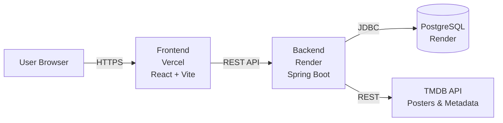

# Movie Recommender

A full-stack movie recommendation system built as a 4-person student project using Agile Scrum methodology. Users can browse nearly 10,000 movies, rate them, and receive personalized recommendations based on their taste.

**Live demo:** [movie-recommender-tau-nine.vercel.app](https://movie-recommender-tau-nine.vercel.app/)

---

## Features

- **Browse & search** ~9,700 movies with posters, overviews, release dates, and ratings (data from MovieLens + TMDB)
- **User accounts** with secure registration and JWT-based authentication
- **Rate movies** on a 5-star scale
- **My Ratings** page to review your rating history
- **Personalized recommendations** based on genre overlap with movies you've rated 4–5 stars
- **Cold-start handling** — new users see top-rated popular films until they rate enough movies
- **Smart fallback** — logged-out visitors see "Popular movies" instead of personalized recs
- **Responsive design** with dark theme and skeleton loading states

---

## Tech stack

| Layer | Technology |
|---|---|
| Frontend | React 19, Vite, React Router |
| Backend | Spring Boot 4.0.3, Java 17, Spring Data JPA |
| Database | PostgreSQL 16 |
| Auth | JWT (jjwt 0.12.6), BCrypt password hashing |
| External APIs | TMDB (movie metadata + posters) |
| Hosting | Vercel (frontend), Render (backend + database) |
| Dataset | MovieLens 9,742 movies |

---

## Architecture



- **Frontend** is a static SPA built with Vite, deployed to Vercel
- **Backend** is a stateless Spring Boot service, deployed as a Docker container on Render
- **Database** is a managed PostgreSQL instance on Render
- **TMDB** is queried during the initial MovieLens import to enrich movies with posters and overviews; results are cached in our database

---

## Screenshots

*Add screenshots here once captured:*

-

---

## Local development

### Prerequisites

- Docker & Docker Compose
- Java 17 (we recommend Eclipse Temurin)
- Node.js 20+
- A free [TMDB API key](https://www.themoviedb.org/settings/api)

### Setup

**1. Clone the repo**

```bash
git clone https://github.com/underground3k/movie-recommender.git
cd movie-recommender
```

**2. Start the database**

```bash
docker-compose up -d db
```

This runs PostgreSQL on `localhost:5432` with credentials defined in `docker-compose.yml`.

**3. Run the backend**

Set the required environment variables, then run from IntelliJ (recommended) or the command line:

```bash
cd backend
TMDB_API_KEY=your_tmdb_key \
JWT_SECRET=your_random_64_char_secret \
./mvnw spring-boot:run
```

The backend starts on `http://localhost:8080`. On first run, it imports all MovieLens movies and enriches them with TMDB data — this takes ~40 minutes.

To skip the wait, restore from a backup:

```bash
docker exec -i movielib_db psql -U movielib_user -d movielib < movies_backup.sql
```

**4. Run the frontend**

```bash
cd frontend
npm install
npm run dev
```

The frontend starts on `http://localhost:5173` and proxies API calls to the backend.

### Verify it's working

- `http://localhost:8080/health` → should return `OK`
- `http://localhost:8080/db-check` → should return `DB OK: 1`
- `http://localhost:5173` → should load the homepage with movies

---

## Environment variables

### Backend

| Variable | Required | Description |
|---|---|---|
| `JWT_SECRET` | yes | Long random string (48+ chars) used to sign JWTs |
| `TMDB_API_KEY` | yes | TMDB API v3 key for fetching posters and metadata |
| `SPRING_DATASOURCE_URL` | yes (prod) | JDBC URL, e.g. `jdbc:postgresql://host:5432/movielib` |
| `SPRING_DATASOURCE_USERNAME` | yes (prod) | Database user |
| `SPRING_DATASOURCE_PASSWORD` | yes (prod) | Database password |
| `SERVER_PORT` | no | Defaults to 8080 |
| `TMDB_IMAGE_URL` | no | Defaults to `https://image.tmdb.org/t/p/w500` |

### Frontend

| Variable | Required | Description |
|---|---|---|
| `VITE_API_URL` | no | Backend base URL. Defaults to `http://localhost:8080` |

For Vercel deployment, set `VITE_API_URL` to the Render backend URL.

---

## API overview

All endpoints return JSON. Protected endpoints require an `Authorization: Bearer <token>` header.

### Authentication

| Method | Endpoint | Auth | Description |
|---|---|---|---|
| POST | `/auth/register` | — | Register a new user |
| POST | `/auth/login` | — | Log in and receive a JWT |

### Movies

| Method | Endpoint | Auth | Description |
|---|---|---|---|
| GET | `/movies?page=0&size=20&search=...` | — | Paginated movie list with optional title search |
| GET | `/movies/popular` | — | Top 12 movies by rating |
| GET | `/movies/{id}` | — | Movie detail |

### Ratings

| Method | Endpoint | Auth | Description |
|---|---|---|---|
| POST | `/ratings` | yes | Create or update a rating |
| GET | `/ratings/{userId}` | yes | Get a user's ratings (must be your own) |

### Recommendations

| Method | Endpoint | Auth | Description |
|---|---|---|---|
| GET | `/recommendations` | yes | Up to 20 personalized recommendations |

---

## Project structure

```
movie-recommender/
├── backend/                          # Spring Boot API
│   ├── src/main/java/com/profai/backend/
│   │   ├── auth/                    # JWT, login, register, filter
│   │   ├── config/                  # CORS configuration
│   │   ├── movie/                   # Movies, genres, TMDB enrichment
│   │   ├── rating/                  # User ratings
│   │   ├── recommendation/          # Content-based recommender
│   │   └── user/                    # User entity & repository
│   ├── src/main/resources/
│   │   ├── application.yml
│   │   └── movielens/movies.csv     # MovieLens dataset
│   ├── src/test/                    # Unit tests
│   ├── Dockerfile
│   └── pom.xml
├── frontend/                         # React + Vite SPA
│   ├── src/
│   │   ├── api/                     # API client functions
│   │   ├── context/                 # Auth context provider
│   │   └── pages/                   # Route components
│   │       └── components/          # Shared UI components
│   ├── index.html
│   └── package.json
├── docker-compose.yml                # Local PostgreSQL
└── README.md
```

---

## How the recommender works

We use a **content-based filtering** approach implemented directly in the Spring Boot backend (no separate ML service required):

1. Take all movies the user has rated **4 or 5 stars**
2. Collect the unique set of **genres** from those movies (their "liked genres")
3. Score every unrated movie by **how many of its genres match** the liked genres
4. Sort by match count, breaking ties by TMDB vote average
5. Return the top 20

**Cold start:** Users with zero ratings see the top-rated movies overall by TMDB score, ensuring everyone has something to browse.

This approach was chosen deliberately over collaborative filtering because:
- It works immediately with sparse user data (we're a small app, not Netflix)
- No model training pipeline needed
- Explainable: "we recommended this because you like Action movies"
- Lightweight: runs in a single SQL-backed Java service

Collaborative filtering and a dedicated Python ML service are documented as future work.

---

## Team

| Member | Role |
|---|---|
| Ignas | Scrum Master |
| Herkus | Backend |
| Deividas | Frontend |
| Zygimantas | Frontend / DevOps |

Built using Agile Scrum across 5 two-week sprints with sprint planning, daily standups, sprint reviews, and retrospectives.

---

## Future work

Features that were deliberately scoped out to ship a polished MVP:

- **Collaborative filtering** using user-user or item-item similarity (matrix factorization)
- **Dedicated ML microservice** (Python + FastAPI) for more advanced models
- **User profiles** with public rating pages and stats
- **Watchlist** separate from ratings
- **Explainability** — "Recommended because you liked X"
- **Onboarding flow** to bootstrap new users by rating 5–10 popular movies
- **Genre filtering and sort options** on the browse page
- **Recommendation caching** to avoid recomputing on every request
- **Comprehensive test coverage** (we have core unit tests; integration tests planned)

---

## License

This project was built for educational purposes as part of a university course. Not licensed for commercial use.

Movie data courtesy of [MovieLens](https://grouplens.org/datasets/movielens/) (GroupLens Research) and [The Movie Database (TMDB)](https://www.themoviedb.org/). This product uses the TMDB API but is not endorsed or certified by TMDB.
